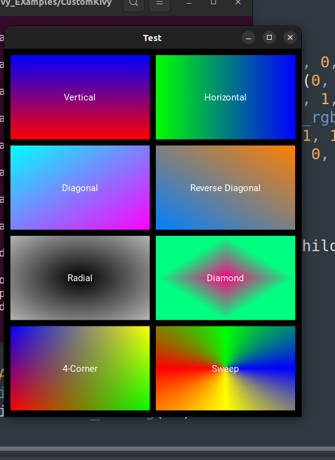

# GLGradient for Kivy

Custom OpenGL-based gradients using Kivy's FBO and GLSL.
## Author

**Sahil Pixel**  
📧 [GitHub](https://github.com/sahil-pixel)


---

## 🌈 Supported Gradient Methods

```python
GLGradient.radial()
GLGradient.vertical()
GLGradient.horizontal()
GLGradient.diagonal()
GLGradient.reverse_diagonal()
GLGradient.corner()
GLGradient.diamond()
GLGradient.sweep()
GLGradient.radial_rainbow()
```

---

## 📦 Example Usage

```python
from kivy.app import App
from kivy.uix.image import Image
from gradient4kivy.gradient import GLGradient

class MyApp(App):
    def build(self):
        tex = GLGradient.radial(
            center_color=(1, 0, 0, 1),
            border_color=(0, 0, 1, 0),
            size=(256, 256)
        )
        return Image(texture=tex)

MyApp().run()
```

---

## 🧪 Gradient Generation

### Radial Gradient

```python
GLGradient.radial(
    border_color=(1, 1, 0, 0),
    center_color=(1, 0, 0, 1),
    size=(256, 256)
)
```

### Vertical Gradient

```python
GLGradient.vertical(
    top_color=(1, 1, 1, 1),
    bottom_color=(0, 0, 0, 0),
    size=(256, 256)
)
```

### Horizontal Gradient

```python
GLGradient.horizontal(
    left_color=(1, 0, 0, 0),
    right_color=(0, 0, 1, 1),
    size=(256, 256)
)
```

### Diagonal Gradient

```python
GLGradient.diagonal(
    start_color=(1, 0, 1, 1),
    end_color=(0, 1, 1, 0),
    size=(256, 256)
)
```

### Reverse Diagonal Gradient

```python
GLGradient.reverse_diagonal(
    start_color=(1, 1, 0, 0.2),
    end_color=(0, 0, 1, 1),
    size=(256, 256)
)
```

### Corner Blend Gradient

```python
GLGradient.corner(
    tl=(1.0, 0.0, 0.0, 1.0),
    tr=(0.0, 1.0, 0.0, 1.0),
    bl=(0.0, 0.0, 1.0, 1.0),
    br=(1.0, 1.0, 0.0, 1.0),
    size=(256, 256)
)
```

### Diamond Gradient

```python
GLGradient.diamond(
    start_color=(0, 1, 0, 1),
    end_color=(0, 0, 1, 0.5),
    size=(256, 256)
)
```

### Sweep Gradient

```python
GLGradient.sweep(
    size=(256, 256),
    colors=[
        (1.0, 0.0, 0.0, 1.0),
        (0.0, 1.0, 0.0, 1.0),
        (0.0, 0.0, 1.0, 1.0),
        (1.0, 1.0, 0.0, 1.0),
        (1.0, 0.0, 0.0, 1.0),
    ],
    stops=[0.0, 0.25, 0.5, 0.75, 1.0]
)
```

### Radial Rainbow

```python
GLGradient.radial_rainbow(
    size=(256, 256),
    base_hue=0.0
)
```
### Full EXample
```python
from kivy.app import App
from kivy.lang import Builder
from kivy.uix.label import Label
from kivy.uix.gridlayout import GridLayout
from kivy.properties import ObjectProperty, ListProperty

from gradient4kivy.gradient import GLGradient

KV = '''
<GradientLabel>:
    canvas.before:
        Rectangle:
            size: self.size
            pos: self.pos
            texture: self.texture_bg

<MyGrid>:
    cols: 2
    spacing: dp(10)
    padding: dp(10)
    canvas.before:
        Color:
            rgba:[1,1,1,1]
        Rectangle:
            pos:self.pos
            size:self.size

    GradientLabel:
        text: 'Vertical'

    GradientLabel:
        text: 'Horizontal'

    GradientLabel:
        text: 'Diagonal'

    GradientLabel:
        text: 'Reverse Diagonal'

    GradientLabel:
        text: 'Radial'

    GradientLabel:
        text: 'Diamond'

    GradientLabel:
        text: '4-Corner'

    GradientLabel:
        text: 'Sweep'
'''


class GradientLabel(Label):
    texture_bg = ObjectProperty(None)


class MyGrid(GridLayout):
    textures = ListProperty()

    def __init__(self, **kwargs):
        super().__init__(**kwargs)

    def on_kv_post(self, *args):
        size = (256, 256)  # Adjust as needed
        self.textures = [
            GLGradient.vertical(top_color=(1, 0, 0, 1),
                                bottom_color=(0, 0, 1, 1), size=size),
            GLGradient.horizontal(left_color=(0, 1, 0, 1),
                                  right_color=(0, 0, 1, 1), size=size),
            GLGradient.diagonal(start_color=(0, 1, 0, 1),
                                end_color=(1, 0, 1, 1), size=size),
            GLGradient.reverse_diagonal(start_color=(
                1, 0.5, 0, 1), end_color=(0, 0.5, 1, 0.1), size=size),
            GLGradient.radial(center_color=(1, 0, 0, 1),
                              border_color=(0, 1, 0, 1), size=size),
            GLGradient.diamond(start_color=(1, 0, 0.5, 1),
                               end_color=(0, 1, 0.5, 1), size=size),
            GLGradient.corner(
                tl=(1.0, 0.0, 0.0, 1.0),
                tr=(0.0, 1.0, 0.0, 1.0),
                bl=(0.0, 0.0, 1.0, 1.0),
                br=(1.0, 1.0, 0.0, 1.0),
                size=size
            ),
            GLGradient.sweep(size=size)
        ]

        for widget, tex in zip(reversed(self.children), self.textures):
            widget.texture_bg = tex


class TestApp(App):
    def build(self):
        Builder.load_string(KV)
        return MyGrid()


if __name__ == '__main__':
    TestApp().run()


```

## 📷 Screenshot

Here's what the app looks like:
<p align="center">
   
</p>

---

## 📝 Notes

- All gradient methods return a `Texture` object.
- You can use the texture on any `Image`, `Rectangle`, or `Widget` background.
- `Fbo` drawing is CPU-light and fully GPU-accelerated via fragment shaders.

## Pay for Support

If you find this project helpful and want to support development, you can donate for support:

-  [](https://ko-fi.com/sahilpixel)
  
- [](https://paypal.me/SKSAHILIN?country.x=IN&locale.x=en_GB)


Thank you for your support!
---

